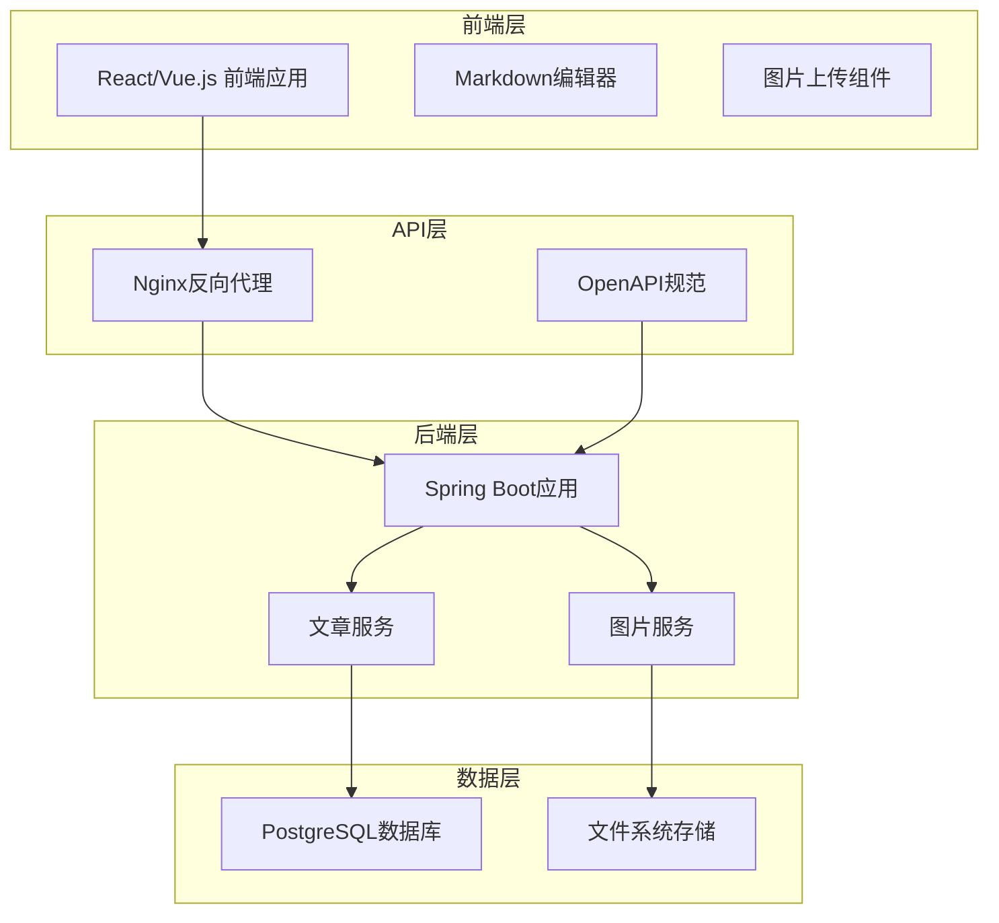
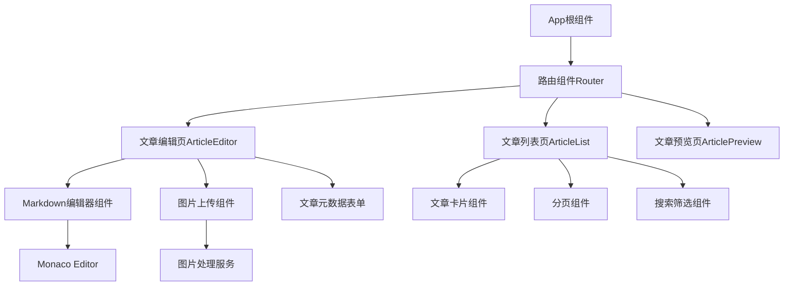
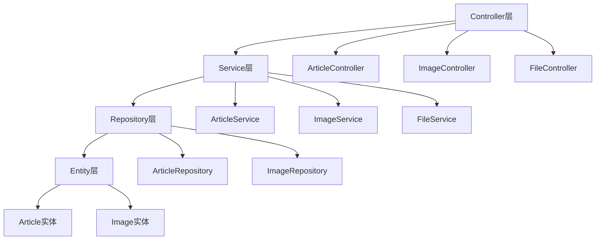
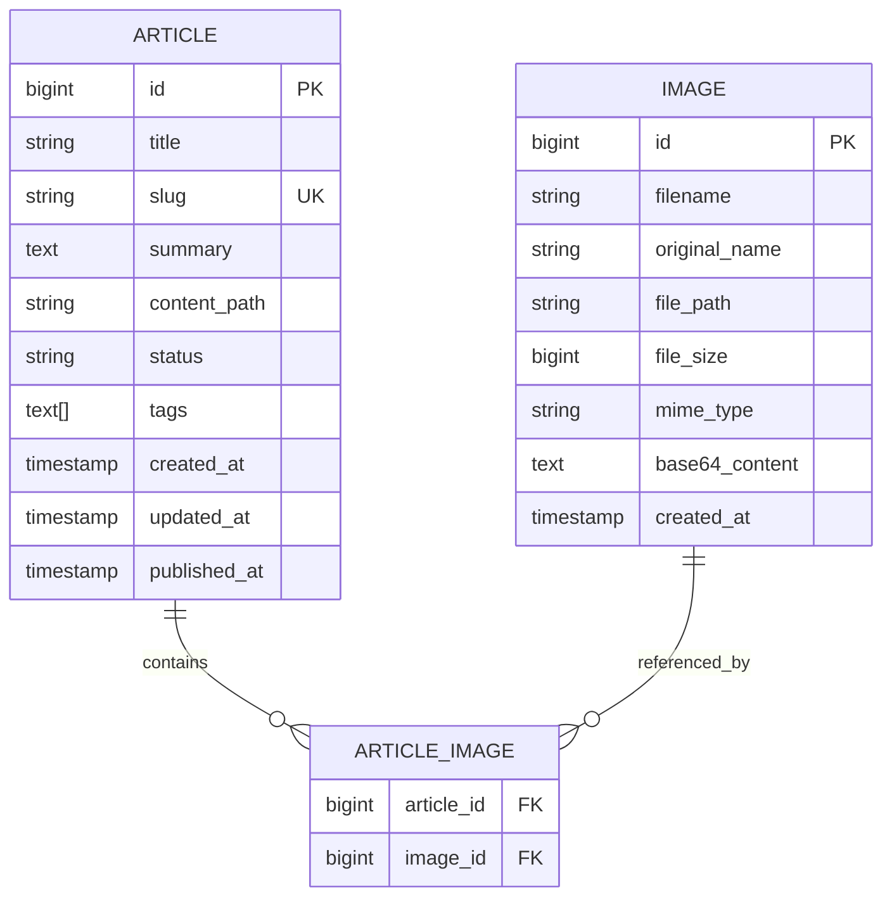
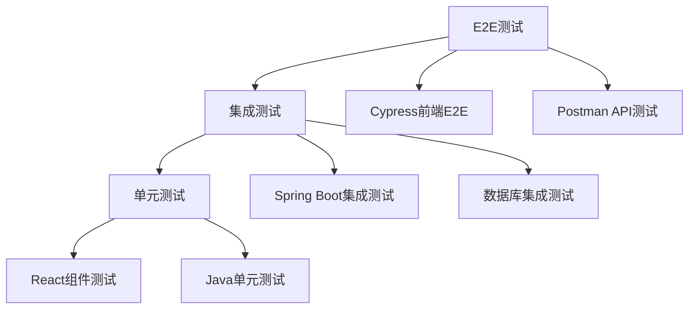

# 个人博客系统设计文档

## 概述

个人博客系统是一个现代化的前后端分离Web应用，采用API First设计原则。系统支持Markdown文章的在线编辑、预览和管理，具备图片处理能力，并支持Docker容器化部署。

## 架构设计

### 整体架构



### 技术栈选择

**前端技术栈:**
- React 18 + TypeScript
- Vite 构建工具
- Ant Design UI组件库
- Monaco Editor (Markdown编辑器)
- Axios HTTP客户端
- React Router 路由管理

**后端技术栈:**
- Java 21 + Spring Boot 3.x
- Spring Data JPA
- PostgreSQL 15
- OpenAPI Generator
- Maven 构建工具
- Spring Security (认证授权)

**部署技术栈:**
- Docker + Docker Compose
- Nginx (反向代理)
- 多阶段构建优化镜像大小

## 组件和接口设计

### API设计 (OpenAPI规范)

**核心API端点:**

```yaml
# 文章管理API
/api/v1/articles:
  GET: 获取文章列表 (支持分页、筛选)
  POST: 创建新文章

/api/v1/articles/{id}:
  GET: 获取文章详情
  PUT: 更新文章
  DELETE: 删除文章

# 图片管理API  
/api/v1/images:
  POST: 上传图片

/api/v1/images/{id}:
  GET: 获取图片
  DELETE: 删除图片

# 文件管理API
/api/v1/files/markdown/{articleId}:
  GET: 获取Markdown文件内容
  PUT: 保存Markdown文件
```

### 前端组件架构



### 后端服务架构



## 数据模型设计

### 数据库表结构

**articles表:**
```sql
CREATE TABLE articles (
    id BIGSERIAL PRIMARY KEY,
    title VARCHAR(255) NOT NULL,
    slug VARCHAR(255) UNIQUE NOT NULL,
    summary TEXT,
    content_path VARCHAR(500) NOT NULL,
    status VARCHAR(20) DEFAULT 'DRAFT',
    tags TEXT[],
    created_at TIMESTAMP DEFAULT CURRENT_TIMESTAMP,
    updated_at TIMESTAMP DEFAULT CURRENT_TIMESTAMP,
    published_at TIMESTAMP
);
```

**images表:**
```sql
CREATE TABLE images (
    id BIGSERIAL PRIMARY KEY,
    filename VARCHAR(255) NOT NULL,
    original_name VARCHAR(255) NOT NULL,
    file_path VARCHAR(500) NOT NULL,
    file_size BIGINT NOT NULL,
    mime_type VARCHAR(100) NOT NULL,
    base64_content TEXT,
    created_at TIMESTAMP DEFAULT CURRENT_TIMESTAMP
);
```

### 实体关系模型



## 错误处理设计

### 统一错误响应格式

```json
{
  "error": {
    "code": "ARTICLE_NOT_FOUND",
    "message": "文章不存在",
    "details": "ID为123的文章未找到",
    "timestamp": "2024-01-01T10:00:00Z",
    "path": "/api/v1/articles/123"
  }
}
```

### 错误码定义

- `VALIDATION_ERROR`: 请求参数验证失败
- `ARTICLE_NOT_FOUND`: 文章不存在
- `IMAGE_UPLOAD_FAILED`: 图片上传失败
- `FILE_SAVE_ERROR`: 文件保存失败
- `DATABASE_ERROR`: 数据库操作失败

### 异常处理策略

1. **前端错误处理**: 使用Axios拦截器统一处理HTTP错误
2. **后端异常处理**: Spring Boot全局异常处理器
3. **文件操作错误**: 重试机制和降级策略
4. **数据库连接错误**: 连接池配置和健康检查

## 测试策略

### 测试金字塔



### 测试覆盖范围

**前端测试:**
- 组件单元测试 (Jest + React Testing Library)
- 用户交互测试 (Cypress)
- API调用测试 (Mock Service Worker)

**后端测试:**
- Service层单元测试 (JUnit 5 + Mockito)
- Repository层集成测试 (TestContainers)
- API端点测试 (MockMvc)

**系统测试:**
- Docker容器启动测试
- 数据库迁移测试
- 性能基准测试

## 部署架构设计

### Docker容器化策略

**前端Dockerfile (多阶段构建):**
```dockerfile
# 构建阶段
FROM node:18-alpine AS builder
WORKDIR /app
COPY package*.json ./
RUN npm ci --only=production
COPY . .
RUN npm run build

# 运行阶段
FROM nginx:alpine
COPY --from=builder /app/dist /usr/share/nginx/html
COPY nginx.conf /etc/nginx/nginx.conf
EXPOSE 80
```

**后端Dockerfile:**
```dockerfile
FROM openjdk:21-jre-slim
WORKDIR /app
COPY target/blog-backend.jar app.jar
EXPOSE 8080
ENTRYPOINT ["java", "-jar", "app.jar"]
```

### Docker Compose配置

```yaml
version: '3.8'
services:
  frontend:
    build: ./frontend
    ports:
      - "3000:80"
    depends_on:
      - backend
      
  backend:
    build: ./backend
    ports:
      - "8080:8080"
    environment:
      - SPRING_DATASOURCE_URL=jdbc:postgresql://db:5432/blog
    depends_on:
      - db
      
  db:
    image: postgres:15-alpine
    environment:
      - POSTGRES_DB=blog
      - POSTGRES_USER=blog_user
      - POSTGRES_PASSWORD=blog_pass
    volumes:
      - postgres_data:/var/lib/postgresql/data
      
volumes:
  postgres_data:
```

### 目录结构设计

```
personal-blog-system/
├── frontend/                 # 前端应用
│   ├── src/
│   ├── public/
│   ├── package.json
│   └── Dockerfile
├── backend/                  # 后端应用
│   ├── src/main/java/
│   ├── src/main/resources/
│   ├── pom.xml
│   └── Dockerfile
├── api/                      # API规范
│   └── openapi.yaml
├── docs/                     # 文档
├── docker-compose.yml        # 容器编排
└── README.md
```

## 安全考虑

### 认证授权
- JWT Token认证机制
- CORS跨域配置
- CSRF防护

### 数据安全
- 输入验证和SQL注入防护
- 文件上传安全检查
- 敏感数据加密存储

### 网络安全
- HTTPS强制重定向
- 安全头配置
- 请求频率限制

## 性能优化

### 前端优化
- 代码分割和懒加载
- 图片压缩和CDN
- 缓存策略

### 后端优化
- 数据库索引优化
- 连接池配置
- 缓存机制 (Redis)

### 部署优化
- 镜像大小优化
- 健康检查配置
- 资源限制设置